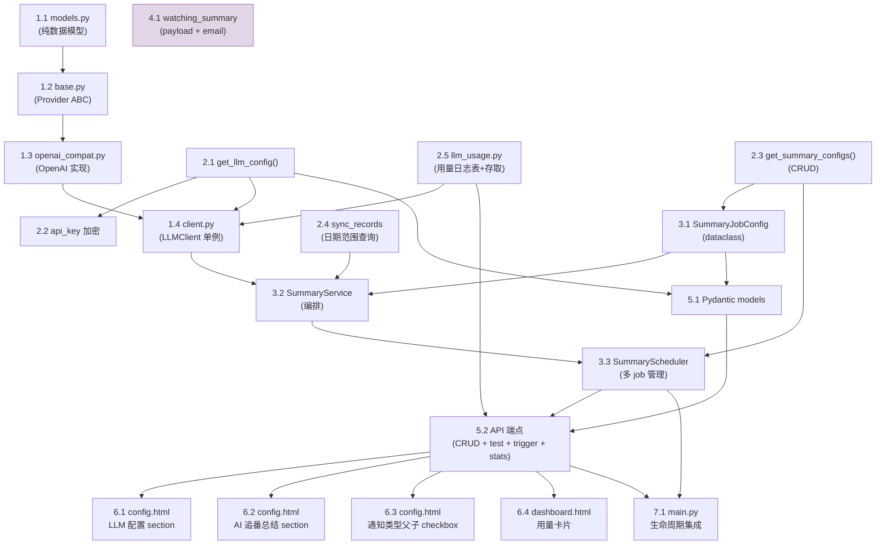

# TDD Task Breakdown: AI-Powered Watching Summaries (Phase 2)

> 与 `SDD/spec.md` 配套。每个任务按 TDD 拆分为 🔴 红灯（测试）、🟡 黄灯（桩代码）、🟢 绿灯（实现）三个阶段。
> Agent 开发完成后更新 `- [ ]` 为 `- [x]` 标记进展。

## Task DAG

**并行度说明：**

| 批次 | 可并行执行的任务 |
|------|-----------------|
| 第一批 | 1.1 + 2.1 + 2.3 + 2.4 + 2.5 + 4.1（无相互依赖） |
| 第二批 | 1.2 + 2.2（依赖第一批完成） |
| 第三批 | 1.3（依赖 1.2） |
| 第四批 | 1.4 + 3.1 + 5.1（依赖前序完成） |
| 第五批 | 3.2（依赖 1.4 + 2.4 + 3.1） |
| 第六批 | 3.3 + 5.2（依赖 3.2 + 5.1） |
| 第七批 | 6.1 + 6.2 + 6.3 + 6.4 + 7.1（全前端 + 集成，依赖 5.2 + 3.3） |

---

## Phase 1: LLM 基础模块

### Task 1.1: LLM 数据模型 `app/services/llm/models.py`

- [ ] 🔴 **红灯** — 编写 `tests/services/llm/test_models.py`
  - 验证 `Message(role, content)` 创建与序列化
  - 验证 `Usage(prompt_tokens, completion_tokens, total_tokens)` 默认值
  - 验证 `ChatResponse(content, model, usage)` 创建与序列化
- [ ] 🟡 **黄灯** — 创建 `app/services/llm/__init__.py`（空），`models.py`（类声明）
- [ ] 🟢 **绿灯** — 实现 `models.py`，`pytest tests/services/llm/test_models.py -v` 全部通过

### Task 1.2: Provider 抽象 `app/services/llm/providers/base.py`

- [ ] 🔴 **红灯** — 编写 `tests/services/llm/test_provider_base.py`
  - 验证 `BaseProvider` 是 ABC，不能直接实例化
  - 验证子类未实现 `chat()` 时抛 TypeError
- [ ] 🟡 **黄灯** — 创建 `app/services/llm/providers/__init__.py`（空），`base.py`（ABC + 抽象 `chat()` 方法）
- [ ] 🟢 **绿灯** — `pytest tests/services/llm/test_provider_base.py -v` 全部通过

### Task 1.3: OpenAI 兼容 Provider `app/services/llm/providers/openai_compat.py`

- [ ] 🔴 **红灯** — 编写 `tests/services/llm/test_provider_openai_compat.py`
  - mock httpx → 正常响应解析（content + usage 提取）
  - 验证 HTTP 错误处理（401, 429, 500）
  - 验证网络超时处理、JSON 解析失败处理
  - 验证请求体格式（model, messages, max_tokens, temperature）
- [ ] 🟡 **黄灯** — 创建 `openai_compat.py`（类声明，`chat()` pass）
- [ ] 🟢 **绿灯** — 实现完整 `chat()`，`pytest tests/services/llm/test_provider_openai_compat.py -v` 全部通过

### Task 1.4: LLM Client 单例 `app/services/llm/client.py`

- [ ] 🔴 **红灯** — 编写 `tests/services/llm/test_client.py`
  - mock config_manager → 验证从 `[llm]` 读取配置
  - mock provider → 验证重试逻辑（失败1次后成功、重试耗尽、指数退避 1s/3s）
  - 验证成本日志格式（model, tokens, latency_ms）
  - 验证 `get_llm_client()` 单例
- [ ] 🟡 **黄灯** — 创建 `client.py`（骨架 + `get_llm_client()`），更新 `__init__.py` 导出
- [ ] 🟢 **绿灯** — 实现完整 `LLMClient`，`pytest tests/services/llm/test_client.py -v` 全部通过

---

## Phase 2: Config + Database 扩展

### Task 2.1: LLM 配置读写 `app/core/config.py`

- [ ] 🔴 **红灯** — 编写 `tests/core/test_config_llm.py`
  - 创建临时 config.ini 写入 `[llm]` section
  - 验证 `get_llm_config()` 返回默认值（未配置时）
  - 验证 `get_llm_config()` 返回配置值（已配置时）
  - 验证 int/float 类型正确转换（max_tokens, temperature, timeout）
- [ ] 🟡 **黄灯** — 在 `ConfigManager` 中添加 `get_llm_config()`（仅返回默认值）
- [ ] 🟢 **绿灯** — 实现完整读取，`pytest tests/core/test_config_llm.py -v` 全部通过

### Task 2.2: LLM API Key 加密 `app/core/config_secret_crypto.py`

- [ ] 🔴 **红灯** — 扩展 `tests/core/test_config_llm.py`
  - 验证 `("llm", "api_key")` 写入后以 `BGS1:` 前缀存储
  - 验证读取时自动解密为明文
- [ ] 🟡 **黄灯** — 在 `is_sensitive_ini_field()` 中添加条件
- [ ] 🟢 **绿灯** — 加密/解密双向测试通过

### Task 2.3: Summary 配置读写 `app/core/config.py`

- [ ] 🔴 **红灯** — 编写 `tests/core/test_config_summary.py`
  - 写入多个 `[summary-N]` sections，验证 `get_summary_configs()` 按 id 排序
  - 验证 `save_summary_config()` 创建/更新
  - 验证 `delete_summary_config(id)` 删除 + 重排剩余 ID
  - 验证 bool/int 类型转换，8 个字段（无 user_prompt_template、webhook_ids、status）
- [ ] 🟡 **黄灯** — 在 `ConfigManager` 中添加三个方法骨架
- [ ] 🟢 **绿灯** — 实现 CRUD，`pytest tests/core/test_config_summary.py -v` 全部通过

### Task 2.4: 数据库日期范围查询 `app/core/database/sync_records.py`

- [ ] 🔴 **红灯** — 编写 `tests/core/test_database_records_range.py`
  - 创建 sync_records 表，插入不同日期/用户的测试数据
  - 验证 `get_records_in_date_range()` 日期过滤、user_name 过滤、limit 截断
  - 验证 `idx_sync_records_timestamp` 索引确保
- [ ] 🟡 **黄灯** — 在 `SyncRecordsRepository` 中添加方法骨架 + 索引确保
- [ ] 🟢 **绿灯** — 实现查询，`pytest tests/core/test_database_records_range.py -v` 全部通过

### Task 2.5: LLM 用量日志 `app/core/database/llm_usage.py`（新文件）

- [ ] 🔴 **红灯** — 编写 `tests/core/test_database_llm_usage.py`
  - 验证 `llm_usage_logs` 表自动创建
  - 验证 `log_llm_usage()` 插入正确
  - 验证 `get_llm_usage_stats(scope="aggregate")` 聚合（total_calls, total_tokens等）
  - 验证 `get_llm_usage_stats(scope="detailed")` 包含 by_job + daily 分组
  - 验证 `cleanup_old_llm_usage_logs(30)` 删除过期数据
- [ ] 🟡 **黄灯** — 创建 `llm_usage.py`（`LLMUsageRepository(BaseRepository)`，表创建 + 方法骨架）
- [ ] 🟢 **绿灯** — 实现完整方法，`pytest tests/core/test_database_llm_usage.py -v` 全部通过

---

## Phase 3: Summary 业务模块

### Task 3.1: SummaryJobConfig `app/services/summary/models.py`

- [ ] 🔴 **红灯** — 编写 `tests/services/summary/test_models.py`
  - 验证 `from_config_dict()` 从字典创建 dataclass（8 字段）
  - 验证默认值（enabled=true, lookback_days=1, cron="0 21 * * *", max_records=200）
  - 确认 `user_prompt_template` 不在 config 字段中
- [ ] 🟡 **黄灯** — 创建 `app/services/summary/__init__.py`（空），`models.py`（dataclass 声明）
- [ ] 🟢 **绿灯** — 实现 `from_config_dict()`，测试通过

### Task 3.2: SummaryService `app/services/summary/service.py`

- [ ] 🔴 **红灯** — 编写 `tests/services/summary/test_service.py`
  - mock DatabaseManager → 验证日期计算（lookback_days）
  - mock DatabaseManager → 验证 user_name 过滤传透
  - mock LLMClient → 验证 system_prompt 被传入 messages[0].content
  - mock LLMClient → 验证内部 `_USER_PROMPT_TEMPLATE` 渲染正确（变量替换）
  - mock LLMClient → 验证 records 格式化（表格输出）
  - mock Notifier → 验证 notification_type 动态拼接（user_name 为空/非空）
  - mock Notifier → 验证 data dict 字段完整（timestamp, job_name, summary_text, date_range, record_count, user_name, model, tokens_used）
  - mock LLMClient 返回错误 → 验证静默跳过不抛异常
- [ ] 🟡 **黄灯** — 创建 `service.py`（类骨架，`generate_summary()` 返回固定字符串，`execute_job()` 空实现）
- [ ] 🟢 **绿灯** — 实现完整逻辑，`pytest tests/services/summary/test_service.py -v` 全部通过

### Task 3.3: SummaryScheduler `app/services/summary/scheduler.py`

> **不继承 BaseScheduler**（BaseScheduler 为单任务设计，SummaryScheduler 需管理多个 job 的多个 cron）。

- [ ] 🔴 **红灯** — 编写 `tests/services/summary/test_scheduler.py`
  - mock config → 验证 `start()` 为所有启用的 `[summary-N]` 注册 cron jobs
  - 验证 `_schedule_all_jobs()` 按 config 创建/更新/删除 jobs
  - 验证 `_parse_cron()` 正确解析 5 字段 cron
  - 验证 `stop()` 关闭 scheduler
  - 验证 `apply_config_after_save()` 联动
  - mock SummaryService → 验证 job 执行调用 `execute_job()`
- [ ] 🟡 **黄灯** — 创建 `scheduler.py`（骨架，参考 `app/services/base/scheduler.py` 的 start/stop 模式）
- [ ] 🟢 **绿灯** — 实现完整逻辑，`pytest tests/services/summary/test_scheduler.py -v` 全部通过

---

## Phase 4: Notifier 扩展

### Task 4.1: watching_summary 通知类型

修改文件：
- `app/utils/notifier/webhook.py` — `_build_payload_by_type`
- `app/utils/notifier/html_builders.py` — `_build_email_dynamic_content`
- `app/utils/notifier/email_sender.py` — `_build_email_subject_by_type`

- [ ] 🔴 **红灯** — 编写 `tests/utils/test_notifier_watching_summary.py`
  - 验证 `"watching_summary" in notification_type` 命中正确 payload
  - 验证 `watching_summary_dad` 也命中同一结构
  - 验证 payload 含 summary_text, job_name, date_range, record_count, user_name
  - 验证邮件标题和 HTML 内容生成正确
  - 验证现有 13 种类型不受影响（回归测试）
- [ ] 🟡 **黄灯** — 三个文件中分别添加 watching_summary 分支（返回空 dict/空字符串）
- [ ] 🟢 **绿灯** — 实现完整 payload/email，测试全部通过 + 现有测试不退化

---

## Phase 5: API 层

### Task 5.1: Pydantic 模型 `app/models/summary.py`

- [ ] 🔴 **红灯** — 编写 `tests/api/test_summary.py`（模型验证部分）
  - 验证 `LLMConfigUpdate` 可选字段
  - 验证 `SummaryJobCreate` 8 个字段 + 默认值
  - 验证 `SummaryJobUpdate` 全可选
  - 验证 `LLMUsageStatsResponse` 结构
- [ ] 🟡 **黄灯** — 创建 `app/models/summary.py`（类声明，字段定义）
- [ ] 🟢 **绿灯** — 模型验证测试通过

### Task 5.2: API 端点 `app/api/summary.py`

- [ ] 🔴 **红灯** — 编写端点测试（FastAPI TestClient + mock）
  - `GET /llm` — 返回配置，api_key 脱敏
  - `PUT /llm` — 更新配置
  - `POST /llm/test` — 测试连接
  - `GET /llm/stats` — 用量统计（支持 ?scope=aggregate/detailed）
  - `GET /api/summary/jobs` — 列表
  - `POST /api/summary/jobs` — 创建
  - `PUT /api/summary/jobs/{id}` — 更新
  - `DELETE /api/summary/jobs/{id}` — 删除
  - `POST /api/summary/jobs/{id}/test` — 测试运行
  - `POST /api/summary/jobs/{id}/trigger` — 手动触发
  - 验证未认证访问返回 401
- [ ] 🟡 **黄灯** — 创建 `app/api/summary.py`（router 骨架，端点返回 mock）
- [ ] 🟢 **绿灯** — 实现完整端点 + config 联动，测试全部通过

---

## Phase 6: 前端（0 个新文件，2 个修改文件）

> 不新增页面，不新增 JS 文件。所有逻辑内联到 `config.html`。

### Task 6.1: LLM 配置 section `templates/config.html`

- [ ] 🔴 **红灯** — 手动验证清单
  - 打开 /config，LLM 配置 section 位于 Bangumi-data 下方、AI 追番总结上方
  - 6 字段表单（api_base, api_key 密码框, model, max_tokens, temperature, timeout）
  - [测试连接] 按钮 → `POST /llm/test` → toast 结果
  - 保存走统一 `section.field` 命名（`llm.api_base`, `llm.api_key`...）
- [ ] 🟡 **黄灯** — 添加 card section HTML + 内联 JS
- [ ] 🟢 **绿灯** — 表单加载/保存/测试连接正常

### Task 6.2: AI 追番总结 section `templates/config.html`

- [ ] 🔴 **红灯** — 手动验证清单
  - Job 卡片列表（row g-3 > col-md-6），空状态提示
  - 卡片展示：开关 toggle、名称、cron、user、back days、本月用量小计
  - [+ 新建] 按钮 → Modal (#summaryJobModal)
  - Modal 表单：name, cron, lookback_days, user_name, system_prompt(textarea), max_records
  - 编辑/删除/测试/触发按钮 → 对应 API 调用
  - 测试结果 Modal：summary 文本 + token 信息
  - 删除确认 Modal
- [ ] 🟡 **黄灯** — 添加 section HTML + 所有 Modal HTML + 内联 JS（card 渲染骨架 + API 调用骨架）
- [ ] 🟢 **绿灯** — 完整 CRUD + Test/Trigger 交互，toast 反馈正确

### Task 6.3: 通知类型父子 checkbox `templates/config.html`

- [ ] 🔴 **红灯** — 手动验证清单
  - 打开 webhook/email Modal → 通知类型列表含父节点 "AI 追番总结 (watching_summary)"
  - 子节点从 `GET /api/summary/jobs` 动态获取，显示为缩进的 checkbox
  - 勾选父 → 所有子自动勾选 → types 写入所有 subtypes
  - 取消父 → 所有子取消
  - 部分勾选子 → 父显示 indeterminate（半选态）
  - 逐个勾选全部子 → 父自动从 indeterminate 变为 checked
  - 新建/删除 summary job 后下次打开 Modal，子节点列表自动同步
- [ ] 🟡 **黄灯** — 修改 `showAddWebhookModal()` / `showEditWebhookModal()`，添加 API 调用 + DOM 追加 + 父子交互逻辑
- [ ] 🟢 **绿灯** — 父子勾选交互全链路正常

### Task 6.4: Dashboard 用量卡片 `templates/dashboard.html`

- [ ] 🔴 **红灯** — 手动验证清单
  - LLM api_key 已配置时展示卡片，未配置时不展示
  - 卡片数据从 `GET /llm/stats?scope=aggregate` 获取
  - 请求失败时静默降级（不展示卡片）
- [ ] 🟡 **黄灯** — 添加 stat cards HTML + `loadDashboardData()` 中新增 API 调用
- [ ] 🟢 **绿灯** — 加载/空状态/失败降级正常

---

## Phase 7: 生命周期集成

### Task 7.1: 应用集成 `app/main.py`

- [ ] 🔴 **红灯** — 手动验证清单
  - 启动 app → summary_router 注册 + summary_scheduler 延迟启动
  - 启动日志正常
  - shutdown 时 scheduler 正常关闭
  - 与其他 scheduler（Trakt/Feiniu/Fongmi）互不影响
- [ ] 🟡 **黄灯** — 导入 + router 注册 + lifecycle hooks（独立 try/except 包裹）
- [ ] 🟢 **绿灯** — 启动/关闭全链路正常
