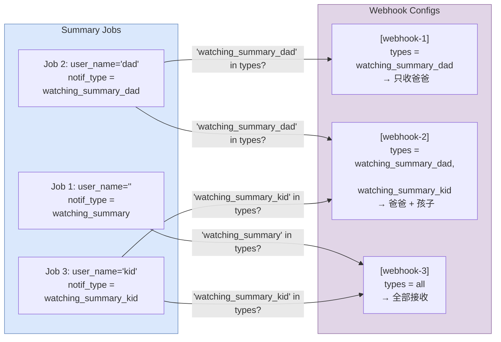
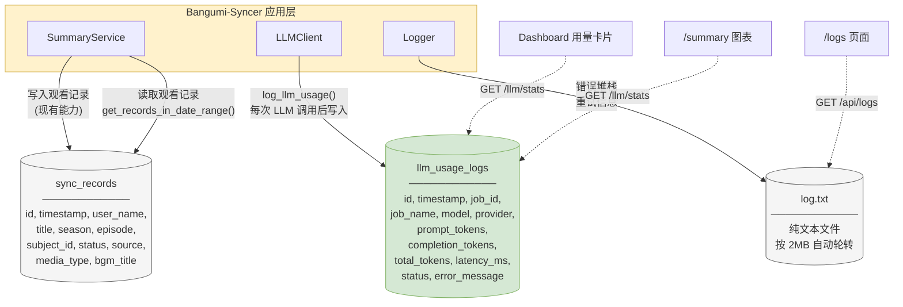
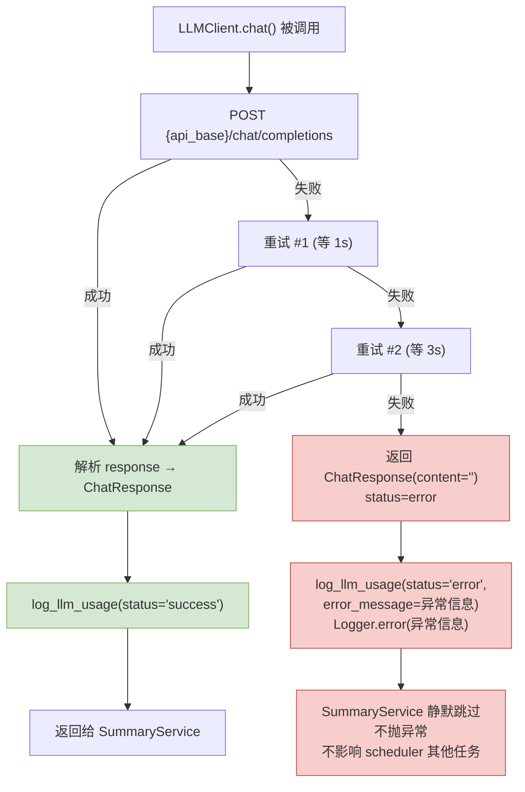
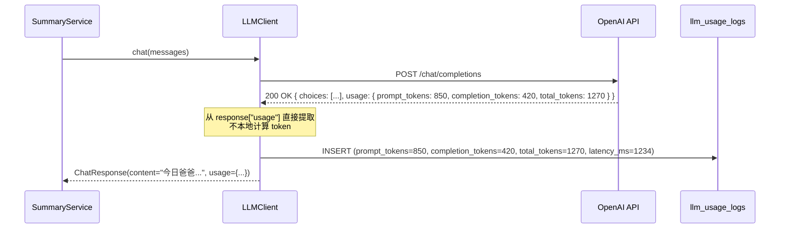

# Backend Data Flow: AI Watching Summary

> **日期**: 2026-07-14
> **用途**: 向 Bangumi-Syncer 维护者澄清 AI 追番总结功能的后端数据流设计，作为 `SDD/spec.md` 的补充说明。

## 1. 完整数据流（Cron → DB → LLM → Webhook）

```mermaid
flowchart TD
    subgraph Trigger["1. APScheduler Cron 触发"]
        A["SummaryScheduler._run_job(job_id=1)"] --> B["从 config.ini [summary-1] 读取配置\n{enabled, name, cron, lookback_days,\n user_name, system_prompt,\n user_prompt_template, max_records}"]
    end

    B --> C["SummaryService.execute_job(job_config)"]

    subgraph Service["2. SummaryService"]
        C --> D["Step A: 计算时间范围\n date_from = now - lookback_days\n date_to = now"]
        D --> E["Step B: 查询 sync_records 表"]
        E --> F["Step C: 格式化记录为文本\n 2026-07-14 20:30 | 葬送的芙莉莲 | S1E10 | plex | success\n ..."]
        F --> G["Step D: 渲染 Prompt 模板\n user_prompt_template.format(\n   date_from, date_to, records,\n   record_count, lookback_days)"]
        G --> H["构建 messages:\n [{role:'system', content:...},\n  {role:'user', content:...}]"]
    end

    H --> I["LLMClient.chat(messages)"]

    subgraph LLM["3. LLMClient"]
        I --> J["Step A: 读取 [llm] 配置\n {api_base, api_key, model,\n  max_tokens, temperature, timeout}"]
        J --> K["Step B: HTTP POST (重试 2 次, 退避 1s/3s)\n POST {api_base}/chat/completions\n Body: {model, messages, max_tokens, temperature}"]
        K --> L["Step C: 解析响应\n choices[0].message.content → summary_text\n usage → {prompt_tokens, completion_tokens, total_tokens}"]
        L --> M["Step D: 写入 llm_usage_logs 表\n (fire-and-forget)"]
    end

    M --> N["返回 summary_text 到 SummaryService"]

    subgraph Notify["4. SummaryService (continued)"]
        N --> O["Step A: 动态 notification type\n user_name 为空 → 'watching_summary'\n user_name='dad' → 'watching_summary_dad'"]
        O --> P["Step B: 构建 data dict\n {timestamp, job_name, summary_text,\n  date_range, record_count, ...}"]
        P --> Q["Step C: 发送\n notifier.send_notification_by_type(\n   notif_type, data)"]
    end

    Q --> R["5. Notifier"]
    subgraph Deliver["5. Notifier"]
        R --> S["匹配 webhook configs\n types 包含 notif_type → match"]
        S --> T["构建 JSON payload\n 'watching_summary' in notif_type → True"]
        T --> U["HTTP POST / SMTP → webhook/email 收到总结"]
    end

    subgraph DBs["Databases"]
        E -.-> DB1[("SQLite: sync_records\n索引: idx_timestamp\n      idx_user_name")]
        M -.-> DB2[("SQLite: llm_usage_logs\n索引: idx_timestamp\n      idx_job_id")]
    end

    style Trigger fill:#ffe6cc,stroke:#d79b00
    style Service fill:#dae8fc,stroke:#6c8ebf
    style LLM fill:#d5e8d4,stroke:#82b366
    style Notify fill:#dae8fc,stroke:#6c8ebf
    style Deliver fill:#e1d5e7,stroke:#9673a6
    style DBs fill:#f5f5f5,stroke:#666666
```

## 2. 多用户路由

匹配机制：`types` 字段是逗号分隔字符串，Notifier 用 `notification_type in types`（Python 字符串包含）做匹配。例如 `"watching_summary_dad" in "watching_summary_dad,watching_summary"` → True。

## 3. 数据存储架构

## 4. 故障处理流程

## 5. Token 计数来源

Token 数据来自 API 服务端的真实计费用量。准确性取决于服务端 tokenizer，但这是唯一可靠标准——所有 LLM 平台都按此计费。
