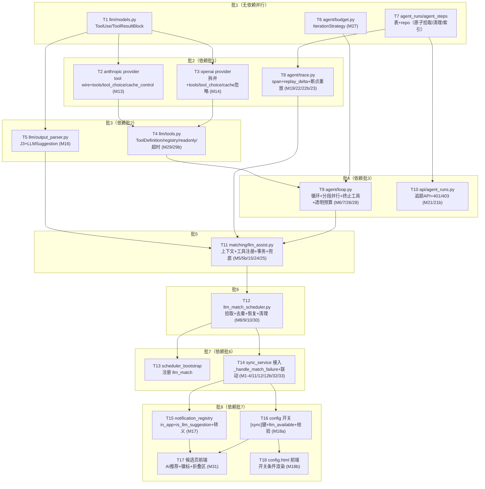

# TDD Task Breakdown: Phase 3 — 通用 Agent 骨架 + LLM 匹配增强

> 配套 spec：`specs/agent-phase3-match.md`（已通过圆桌验收，有条件通过项已全部落实）
> 执行位置：**本 worktree（support_agent）**——所有文件读写均在 `/Users/lflops/WorkSpace/Code/02_Worktree/support_agent` 下
> 每个任务按 TDD 拆分为 🔴 红灯（测试）→ 🟡 黄灯（桩代码）→ 🟢 绿灯（实现）三步；完成后更新 `- [x]` 为 `- [x]`
> 场景对应：M 编号见 spec §6；协议回归见 phase2.1 spec T1-T7

## Task DAG



**并行度**：每批 2~4 个任务并行（同文件不并行——批内任务文件互不重叠）。

## 批次总览

| 批次 | 任务 | 依赖 | 场景 |
|---|---|---|---|
| 批 1 | T1 + T6 + T7 | 无 | M27 / M19 前置 |
| 批 2 | T2 + T3 + T8 | 批 1 | M13 / M14 / M19/M22/M22b/M23 |
| 批 3 | T4 + T5 | 批 2 | M29 / M29b / M16 |
| 批 4 | T9 + T10 | 批 3 + T6/T7 | M6/M7/M26/M28 / M21/M21b |
| 批 5 | T11 | 批 4 + T5 | M5/M5b/M15/M24/M25 |
| 批 6 | T12 | T11 + T7 | M8/M9/M10/M30 |
| 批 7 | T13 + T14 | 批 6 | M1-M4/M11/M12/M12b/M32/M33 |
| 批 8 | T15 + T16 + T17 + T18 | 批 7 | M17 / M18a / M31 / M18b |

---

## 批 1：无依赖（并行 3）

### Task T1: LLM 数据模型扩展 `app/services/llm/models.py`

- [x] 🔴 **红灯** — 编写 `tests/services/llm/test_tool_blocks.py`（M13/M14 前置 + phase2.1 T1/T2/T5 回归）
  - `ToolUseBlock(id, name, input)` / `ToolResultBlock(tool_use_id, content, is_error)` 创建与序列化
  - `ContentBlock` union 可承载全部五种 block（Text/Thinking/Redacted/ToolUse/ToolResult）
  - `ChatResponse.blocks` 含 tool block 时无损往返
  - 向后兼容：现有 Text/Thinking 行为不变（回归现有测试）
- [x] 🟡 **黄灯** — `models.py` 追加两个类 + union 扩展
- [x] 🟢 **绿灯** — `uv run pytest tests/services/llm/test_tool_blocks.py -v` 通过；既有 llm 测试不退化

### Task T6: 预算策略 `app/services/agent/budget.py`（新包）

- [x] 🔴 **红灯** — 编写 `tests/services/agent/test_budget.py`（M27）
  - `MatchIterationStrategy`: off=1/low=2/medium=3/high=5；未知 level 兜底 3
  - `register_iteration_strategy` 注册后 `get_max_iterations(task_type, level)` 返回该策略映射
  - 不同 task_type 策略互不影响；重复注册覆盖
  - 优先级：外部传入配置值 > 策略映射 > 默认兜底
- [x] 🟡 **黄灯** — 创建 `app/services/agent/__init__.py` + `budget.py`（Protocol + 注册表 + Match 预设）
- [x] 🟢 **绿灯** — `uv run pytest tests/services/agent/test_budget.py -v` 通过

### Task T7: 会话表 + repo `app/core/database/agent_runs.py`

- [x] 🔴 **红灯** — 编写 `tests/core/test_agent_runs.py`
  - `agent_runs` 建表（status 枚举不含 exhausted；total_attempts；索引 idx_agent_runs_sync_record_id/status）
  - `agent_steps` 建表（iteration/sequence/payload_json/replay_delta）
  - repo：create_pending（run_id+sync_record_id）/ atomic_claim（`UPDATE ... WHERE status='pending'`，affected=0 返回 None）/ mark_succeeded / mark_no_suggestion / mark_failed（attempts/last_error）/ increment_attempts
  - 重新入队：同 key failed 且 total_attempts≤10 → 重置 attempts 回 pending、total_attempts+1；>10 拒绝
  - 清理：终态且 ended_at 超保留期 → 先删 agent_steps 再删 agent_runs（级联）
  - 按 sync_record_id 查活跃（pending/processing/succeeded）记录（去重用）
- [x] 🟡 **黄灯** — `agent_runs.py`（BaseRepository 子类）+ `connection.py` 建表 + 索引
- [x] 🟢 **绿灯** — `uv run pytest tests/core/test_agent_runs.py -v` 通过

---

## 批 2：依赖批 1（并行 3）

### Task T2: Anthropic 工具协议 `app/services/llm/providers/anthropic.py`

- [x] 🔴 **红灯** — 编写 `tests/services/llm/test_provider_anthropic_tools.py`（M13 + phase2.1 T1/T6）
  - `_build_request`：内部 ToolUseBlock → wire tool_use block（1:1）；多 tool_use 同消息共存
  - 内部 ToolResultBlock → wire tool_result block（user content）
  - `tools` 参数透传：name/description/input_schema（JSON Schema → Anthropic 格式）
  - `tool_choice` 透传：`{"type": "tool", "name": "..."}`
  - `cache_control` 标记：system/tools 块可携带 `{"type": "ephemeral"}`
  - `_parse_response`：wire tool_use → ToolUseBlock + stop_reason="tool_use"
- [x] 🟡 **黄灯** — anthropic.py 扩展（替换"未知 block 跳过"逻辑）
- [x] 🟢 **绿灯** — 新测试 + 既有 anthropic 测试全部通过

### Task T3: OpenAI 工具协议 `app/services/llm/providers/openai_compat.py`

- [x] 🔴 **红灯** — 编写 `tests/services/llm/test_provider_openai_tools.py`（M14 + phase2.1 T3/T4/T5/T7）
  - 内部 ToolUseBlock → assistant.tool_calls（arguments 为 JSON 字符串）
  - 内部 ToolResultBlock → 多条 role=tool 消息（tool_call_id 对应）
  - wire tool_calls/tool 消息 → 合并回内部 ToolUseBlock/ToolResultBlock；arguments 解析失败兜底 `{"raw": ...}`
  - `tools` 参数透传（type=function/function.name/function.parameters）
  - `tool_choice` 透传：`{"type": "function", "function": {"name": "..."}}`
  - **`cache_control` 忽略不发送**（F17）
  - content 混排防御（text + tool_result）
- [x] 🟡 **黄灯** — openai_compat.py 扩展
- [x] 🟢 **绿灯** — 新测试 + 既有 openai 测试全部通过

### Task T8: span 记录器 `app/services/agent/trace.py`

- [x] 🔴 **红灯** — 编写 `tests/services/agent/test_trace.py`（M19/M22/M22b/M23 前置）
  - `start_span(run_id, name, iteration, sequence)` / `end_span(...)`：写 agent_steps（独立 best-effort 事务，失败不影响主流程）
  - llm_chat span end 写 `replay_delta={response: {stop_reason, content, tool_calls}}`；tool_execute span end 写 `replay_delta={tool_result}` + budget_message 归属
  - `payload_json` 观测摘要（结构化截断 ≤2KB 保 JSON 合法）
  - 断点重放 `replay(run)`：种子（system 静态 + user 还原）→ 按 (iteration, sequence) 分组：从 llm_chat.tool_calls 聚合重建 assistant → 逐条 tool_result → 预算消息（确定性重建）
  - 缺失工具识别：S（llm_chat.tool_calls 全量）- R（已记录 tool_execute）= 补执行集（readonly 校验）
  - 恢复语义：最后一条完整 llm_chat 且未产生 tool/终止 → 直接消费响应分派（end_turn/tool_use/submit）
- [x] 🟡 **黄灯** — `trace.py`（依赖 T7 的 agent_steps repo）
- [x] 🟢 **绿灯** — `uv run pytest tests/services/agent/test_trace.py -v` 通过

---

## 批 3：依赖批 2（并行 2）

### Task T4: 工具注册表 `app/services/llm/tools.py`

- [x] 🔴 **红灯** — 编写 `tests/services/llm/test_tools.py`（M29/M29b）
  - `ToolDefinition`：access read/write/terminal + readonly 默认推导（read→True）+ 显式覆盖
  - 注册：重复注册告警/拒绝；`execute` 未注册工具 → 错误；JSON Schema 校验失败 → 错误且不调用 handler
  - write 级执行前审计日志；terminal 级**不执行 handler** 仅捕获参数
  - 工具超时（30s）→ is_error=True 的 ToolResultBlock
  - 分段并行：`execute_batch(tool_calls)`——连续 read 段 gather 并行（保序）、非只读单独串行、按原始顺序返回 results dict；含 terminal 由调用方先行处理
  - readonly 不序列化进 schema（schema 输出仅 name/description/parameters）
- [x] 🟡 **黄灯** — `tools.py`（依赖 T2/T3 的协议层）
- [x] 🟢 **绿灯** — `uv run pytest tests/services/llm/test_tools.py -v` 通过

### Task T5: 结构化解析器 `app/services/llm/output_parser.py`

- [x] 🔴 **红灯** — 编写 `tests/services/llm/test_output_parser.py`（M16 前置）
  - 从带前后缀噪声文本提取 JSON；畸形 JSON/超长/类型错误 → None（不抛）
  - `LLMSuggestion` dataclass：subject_id（^\d+$ 校验）/ reason（maxLength 200）校验
  - 校验失败返回明确错误原因（供 last_error）
- [x] 🟡 **黄灯** — `output_parser.py`（依赖 T1 models）
- [x] 🟢 **绿灯** — `uv run pytest tests/services/llm/test_output_parser.py -v` 通过

---

## 批 4：依赖批 3（并行 2）

### Task T9: 轻量循环 `app/services/agent/loop.py`

- [x] 🔴 **红灯** — 编写 `tests/services/agent/test_loop.py`（M6/M7/M26/M28 + 分段并行 + 终止 + 预算）
  - end_turn / 空响应 → stop_reason=end_turn
  - assistant 聚合消息先于 tool_result（协议顺序，mock provider 验证消息序列）
  - submit_suggestion 捕获即 break（stop_reason=submit_suggestion），其他工具不执行
  - 分段并行调用 tools.execute_batch（mock 验证 gather/串行路径）
  - 透明预算：每轮追加 `[剩余轮次：N]`；remaining==0 时 tool_choice=terminal
  - 畸形 tool_use（unknown name/重复 id/非 JSON）→ is_error 回填循环继续
  - max_iterations 耗尽 → stop_reason=exhausted
  - **不直接调 LLMClient**：LLM 调用经注入的 chat 函数（可 mock），供 llm_assist 场景层注入
- [x] 🟡 **黄灯** — `loop.py`（依赖 T4 的 execute_batch + T6 的 max_iterations）
- [x] 🟢 **绿灯** — `uv run pytest tests/services/agent/test_loop.py -v` 通过

### Task T10: 追踪 API `app/api/agent_runs.py`

- [x] 🔴 **红灯** — 编写 `tests/api/test_agent_runs.py`（M21/M21b）
  - `GET /api/agent/runs/{run_id}`：run 信息（status/stop_reason/tokens）；未认证 401；非本人/非管理 403（经 sync_record_id 关联校验）；不存在 404
  - `GET /api/agent/runs/{run_id}/steps`：span 列表按 (iteration, sequence) 排序
- [x] 🟡 **黄灯** — `agent_runs.py` router + `main.py` 注册
- [x] 🟢 **绿灯** — `uv run pytest tests/api/test_agent_runs.py -v` 通过

---

## 批 5：依赖批 4

### Task T11: 匹配场景服务 `app/services/matching/llm_assist.py`

- [x] 🔴 **红灯** — 编写 `tests/services/matching/test_llm_assist.py`（M5/M5b/M15/M24/M25）
  - 上下文构建：从 sync_records（含 match_trace）还原 title/ori_title/season/media_type/release_date/user_name + 候选摘要（无候选 → 空候选提示）；prompt 注入防护（`---` 分隔 + 不可信声明）
  - 工具注册：search/get_detail/check/related（read）+ submit_suggestion（terminal）
  - `run(run)`：置 processing（原子拾取后）→ loop → 结果处理：
    - submit_suggestion 捕获 → `_validate_subject_id` 校验 → 通过：事务内写 pending_candidates（llm 两列，有候选更新/无候选新建）+ agent_runs succeeded；失败：no_suggestion + last_error
    - exhausted → output_parser 兜底（成功→succeeded 落库；失败→no_suggestion）
    - LLM 调用失败 → attempts+1（≤3）→ failed
    - 通知在事务提交后 best-effort（is_llm_suggestion + llm_reason 传参）
  - 全链路 M24：无候选 → LLM 搜索 → 建议 → 落库 → confirm 走通
- [x] 🟡 **黄灯** — `llm_assist.py`（依赖 T5/T8/T9 + T7 repo）
- [x] 🟢 **绿灯** — `uv run pytest tests/services/matching/test_llm_assist.py -v` 通过

---

## 批 6：依赖批 5

### Task T12: 调度器 `app/services/llm_match_scheduler.py`

- [x] 🔴 **红灯** — 编写 `tests/services/test_llm_match_scheduler.py`（M8/M9/M10/M30 + 恢复）
  - 启用条件：`llm_match_assist=true` 且 LLM 配置存在（否则不启动 + 日志）
  - 原子拾取：`UPDATE ... WHERE status='pending'` affected=0 跳过（模拟双调度竞争）
  - 恢复扫描：processing 且 started_at 超 120s → 刷新 started_at → trace.replay → 续跑；sync_records 缺失 → failed+error
  - 去重：同 key 已有 pending/processing/succeeded/no_suggestion（未超保留期）→ 跳过 + 日志
  - 清理：终态超保留期 → 先 steps 后 runs + 日志计数
  - 重试：attempts+1 ≤3 → failed（last_error）
  - 串行逐条处理（每轮最多处理 N 条防堆积）
- [x] 🟡 **黄灯** — `llm_match_scheduler.py`（BaseScheduler，依赖 T7/T11）
- [x] 🟢 **绿灯** — `uv run pytest tests/services/test_llm_match_scheduler.py -v` 通过

---

## 批 7：依赖批 6（并行 2）

### Task T13: 调度器注册 `app/services/scheduler_bootstrap.py`

- [x] 🔴 **红灯** — 扩展 `tests/services/test_scheduler_bootstrap.py`
  - `register_all()` 注册 llm_match（JobSpec(scheduler_id="llm_match", runner=llm_match_scheduler)）
  - 重复注册覆盖告警；registry 可查询到
- [x] 🟡 **黄灯** — bootstrap 加 3 行注册
- [x] 🟢 **绿灯** — 测试通过

### Task T14: 匹配失败接入 + 联动 `app/services/sync_service/`

- [x] 🔴 **红灯** — 编写 `tests/services/test_match_assist_integration.py`（M1-M4/M11/M12/M12b/M32/M33）
  - `_handle_match_failure` 接入：开关开+LLM 可用 → 落 agent_runs(pending) + trace 补 llm_assist step（**persist 前**，run_id 幂等）；开关关/配置缺失 → 原逻辑不变 + 日志
  - 去重：同 key 活跃记录存在 → 跳过
  - failed 复用：total_attempts≤10 重置入队
  - `confirm_pending_candidate`：body 可选 llm_subject_id（允许确认不在 candidates_json 中的建议）；写映射 + 补发 + agent_runs→applied（WHERE status='succeeded' 守卫）；无关联 run → no-op
  - `reject_pending_candidate`：→ rejected；联动 agent_runs→rejected（守卫）
  - 手动确认非 AI 候选（M32）与向后兼容（M33：无 llm_subject_id 走原逻辑）
- [x] 🟡 **黄灯** — `orchestrator.py` 失败分支 + `__init__.py` confirm/reject 联动 + `api/sync.py` confirm body 扩展
- [x] 🟢 **绿灯** — 新测试 + 既有 sync_service 测试不退化（`uv run pytest tests/services/ -k "sync or match or pending"`）

---

## 批 8：依赖批 7（并行 4）

### Task T15: 通知增强 `app/core/notification_registry.py` + 通知触发处

- [x] 🔴 **红灯** — 扩展 `tests/core/test_notification_registry.py` + `tests/utils/test_notifier_pending_candidate.py`（M17）
  - `pending_candidate` meta：in_app_type="match_pending" + in_app_title_template="匹配待确认：{title} {ep_label}"
  - 通知触发处：is_llm_suggestion=true 时正文加 `[AI 建议] ` 前缀 + llm_reason；false 无前缀
  - **渲染转义**：llm_reason 与 title 经 HTML escape + 模板语法转义（构造含 `<script>`/`{{...}}` 的 reason/title 断言原样输出）
- [x] 🟡 **黄灯** — registry + 通知触发处（依赖 T14 触发点）
- [x] 🟢 **绿灯** — 新断言 + 既有通知测试不退化

### Task T16: 配置与开关 `app/core/config.py` + `app/api/config.py`

- [x] 🔴 **红灯** — 扩展 `tests/core/test_config.py` + `tests/api/test_config.py`（M18a + M27 配置覆盖）
  - `[sync]` 新键读取：llm_match_assist(false)/llm_match_cron(*/1 * * * *)/llm_match_retention_days(7)/llm_match_max_iterations(空)/llm_match_cross_call_cache(false)/llm_match_recovery_timeout_s(120)
  - 配置保存 API：开启 llm_match_assist 时校验 LLM api_key 非空，否则拒绝 + "需先配置 LLM"
  - `GET /api/sync/config` 返回 llm_available 标志
- [x] 🟡 **黄灯** — config.py 键读取 + config API 校验
- [x] 🟢 **绿灯** — 测试通过 + 既有 config 测试不退化

### Task T17: 候选页前端 `templates/pending_candidates.html` + `static/js/`

- [x] 🔴 **红灯** — 手动验证清单（Playwright 场景 M31 派生）
  - 列表行徽标：pending/processing → "AI 评估中"；succeeded+建议 → "AI 推荐"；无 llm 字段 → 无徽标
  - 详情弹窗 AI 推荐区块：subject_id + reason + 「应用建议」按钮（bypass → confirm 带 llm_subject_id）
  - AI 评估过程折叠区：`GET /api/agent/runs/{run_id}/steps` span 简表
  - 读路径：列表/详情 API 返回 llm 两列 + agent_runs.status（联调 T14）
- [x] 🟡 **黄灯** — HTML 区块 + JS 交互骨架
- [x] 🟢 **绿灯** — 手动 + Playwright（如有）验证通过

### Task T18: 配置页前端 `templates/config.html`

- [x] 🔴 **红灯** — 手动验证清单（M18b）
  - LLM 未配置：开关不显示 + "需先配置 LLM"提示
  - LLM 已配置：开关显示；保存成功提示
- [x] 🟡 **黄灯** — config.html 开关区块（条件渲染）
- [x] 🟢 **绿灯** — 手动验证通过

---

## 验证命令

```bash
# 全量（AGENTS.md 规范）
uv run pytest tests/ --cov=app --cov-report=term
uv run ruff check .
uv run ruff format .
```

## 收尾检查清单（每批完成后）

- [x] 该批场景对应测试全绿；`uv run ruff check .` 无新告警
- [x] 既有测试不退化（全量 pytest 关键目录）
- [x] 无 secrets 入库（LLM api_key 仅走配置）